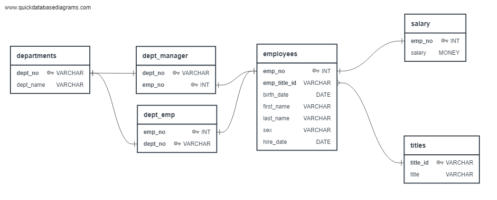
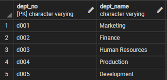
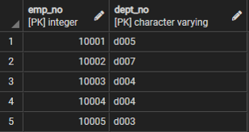
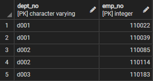
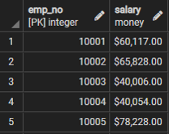
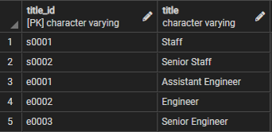
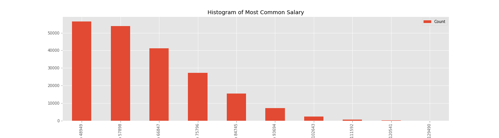
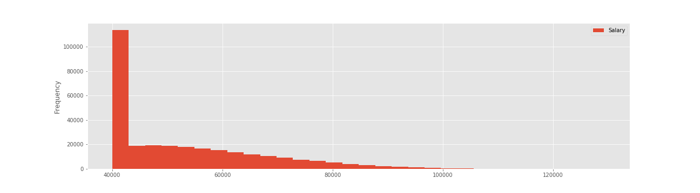
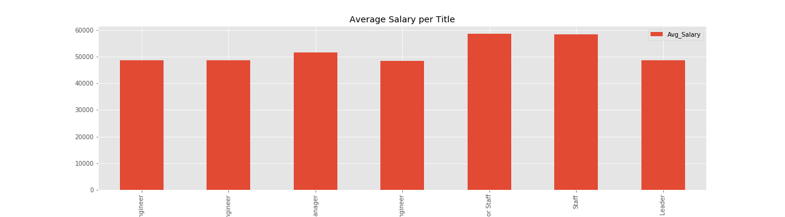

### Homework - sql-challenge
##### Student: Matheus Gratz      
---
Table of contents 
1. [ERD](#erd)
2. [postgreSQL Statements](#post_stats)
3. [Import CSVs](#import_csv)
    * departments
    * dept_emp
    * dept_manager
    * employees
    * titles
    * salary
4. [Tasks](#tasks)
5. [Bonus Round](#bonus)
6. [Epilogue](#epilogue)
---

### ERD 
[Go back to the table of contents](#toc)

- Use http://www.quickdatabasediagrams.com to define the ERD of tables

In order to replicate the same relationship, you can use the code as follows:
~~~sql
departments
-
dept_no VARCHAR PK
dept_name VARCHAR

dept_emp
-
emp_no INT PK FK - employees.emp_no
dept_no VARCHAR PK FK - departments.dept_no

dept_manager
-
dept_no VARCHAR PK FK - departments.dept_no
emp_no INT PK FK - employees.emp_no

employees
-
emp_no INT PK
emp_title_id VARCHAR FK >- titles.title_id
birth_date DATE
first_name VARCHAR
last_name VARCHAR
sex VARCHAR
hire_date DATE

titles
-
title_id VARCHAR PK
title VARCHAR

salary
-
emp_no INT PK FK - employees.emp_no
salary MONEY
~~~
---
### postgreSQL Statements 
[Go back to the table of contents](#toc)

With that, export the SQL statement in postgreSQL format and import to query editor to create tables and stablish relationships. The code is:
~~~sql
DROP TABLE IF EXISTS dept_emp;
DROP TABLE IF EXISTS dept_manager;
DROP TABLE IF EXISTS salary;
DROP TABLE IF EXISTS employees;
DROP TABLE IF EXISTS departments;
DROP TABLE IF EXISTS titles;

CREATE TABLE "departments" (
    "dept_no" VARCHAR   NOT NULL,
    "dept_name" VARCHAR   NOT NULL,
    CONSTRAINT "pk_departments" PRIMARY KEY (
        "dept_no"
     )
);

CREATE TABLE "dept_emp" (
    "emp_no" INT   NOT NULL,
    "dept_no" VARCHAR   NOT NULL,
    CONSTRAINT "pk_dept_emp" PRIMARY KEY (
        "dept_no"
     )
);

CREATE TABLE "dept_manager" (
    "dept_no" VARCHAR   NOT NULL,
    "emp_no" INT   NOT NULL,
    CONSTRAINT "pk_dept_manager" PRIMARY KEY (
        "dept_no","emp_no"
     )
);

CREATE TABLE "employees" (
    "emp_no" INT   NOT NULL,
    "emp_title_id" VARCHAR   NOT NULL,
    "birth_date" DATE   NOT NULL,
    "first_name" VARCHAR   NOT NULL,
    "last_name" VARCHAR   NOT NULL,
    "sex" VARCHAR   NOT NULL,
    "hire_date" DATE   NOT NULL,
    CONSTRAINT "pk_employees" PRIMARY KEY (
        "emp_no"
     )
);

CREATE TABLE "titles" (
    "title_id" VARCHAR   NOT NULL,
    "title" VARCHAR   NOT NULL,
    CONSTRAINT "pk_titles" PRIMARY KEY (
        "title_id"
     )
);

CREATE TABLE "salary" (
    "emp_no" INT   NOT NULL,
    "salary" MONEY   NOT NULL,
    CONSTRAINT "pk_salary" PRIMARY KEY (
        "emp_no"
     )
);

ALTER TABLE "dept_emp" ADD CONSTRAINT "fk_dept_emp_emp_no" FOREIGN KEY("emp_no")
REFERENCES "employees" ("emp_no");

ALTER TABLE "dept_manager" ADD CONSTRAINT "fk_dept_manager_dept_no" FOREIGN KEY("dept_no")
REFERENCES "departments" ("dept_no");

ALTER TABLE "dept_manager" ADD CONSTRAINT "fk_dept_manager_emp_no" FOREIGN KEY("emp_no")
REFERENCES "employees" ("emp_no");

ALTER TABLE "employees" ADD CONSTRAINT "fk_employees_emp_title_id" FOREIGN KEY("emp_title_id")
REFERENCES "titles" ("title_id");

ALTER TABLE "salary" ADD CONSTRAINT "fk_salary_emp_no" FOREIGN KEY("emp_no")
REFERENCES "employees" ("emp_no");
~~~
---
### Import CSVs to tables 
[Go back to the table of contents](#toc)

For that, I ran a statement for each table to check if everything is ok.

1. departments
~~~sql 
SELECT * FROM departments LIMIT(5);
~~~

2. dept_emp
~~~sql 
SELECT * FROM dept_emp LIMIT(5);
~~~

3. dept_manager
~~~sql 
SELECT * FROM dept_manager LIMIT(5);
~~~

4. employees
~~~sql 
SELECT * FROM employees LIMIT(5);
~~~

5. salary
~~~sql 
SELECT * FROM salary LIMIT(5);
~~~

6. titles
~~~sql 
SELECT * FROM titles LIMIT(5);
~~~

---
### Tasks 
[Go back to the table of contents](#toc)

1. List the following details of each employee: employee number, last name, first name, sex, and salary.

~~~sql
SELECT 
	e.emp_no,
	e.first_name,
	e.last_name,
	e.sex,
	s.salary
FROM employees AS e
INNER JOIN salary AS s
ON e.emp_no = s.emp_no;
~~~

2. List first name, last name, and hire date for employees who were hired in 1986.

~~~sql
SELECT 
	e.first_name,
	e.last_name,
	e.hire_date
FROM employees AS e
WHERE e.hire_date >= '1986-01-01'
AND   e.hire_date <= '1986-12-31';

~~~

3. List the manager of each department with the following information: department number, department name, the manager's employee number, last name, first name.

~~~sql
SELECT
	d.dept_no,
	d.dept_name,
	e.emp_no,
	e.last_name,
	e.first_name
FROM employees AS e

INNER JOIN dept_manager AS dm
ON e.emp_no = dm.emp_no

INNER JOIN departments AS d
ON dm.dept_no = d.dept_no;

~~~

4. List the department of each employee with the following information: employee number, last name, first name, and department name.

~~~sql
SELECT
	e.emp_no,
	e.last_name,
	e.first_name,
	d.dept_name
FROM employees AS e

INNER JOIN dept_emp AS de
ON e.emp_no = de.emp_no

INNER JOIN departments AS d
ON de.dept_no = d.dept_no;
~~~

5. List first name, last name, and sex for employees whose first name is "Hercules" and last names begin with "B."

~~~sql
SELECT 
	e.first_name,
	e.last_name,
	e.sex
FROM employees AS e

WHERE 1=1
AND e.first_name = 'Hercules'
AND e.last_name LIKE 'B%';
~~~

6. List all employees in the Sales department, including their employee number, last name, first name, and department name.

~~~sql
SELECT
	e.emp_no,
	e.last_name,
	e.first_name,
	d.dept_name
FROM employees AS e

INNER JOIN dept_emp AS de
ON e.emp_no = de.emp_no

INNER JOIN departments AS d
ON de.dept_no = d.dept_no

WHERE d.dept_name = 'Sales';

~~~

7. List all employees in the Sales and Development departments, including their employee number, last name, first name, and department name.

~~~sql
SELECT
	e.emp_no,
	e.last_name,
	e.first_name,
	d.dept_name
FROM employees AS e

INNER JOIN dept_emp AS de
ON e.emp_no = de.emp_no

INNER JOIN departments AS d
ON de.dept_no = d.dept_no

WHERE d.dept_name = 'Sales'
OR d.dept_name = 'Development';
~~~

8. In descending order, list the frequency count of employee last names, i.e., how many employees share each last name.

~~~sql
SELECT
	e.last_name,
	COUNT(e.emp_no) AS "Number of Employees"
FROM employees AS e
GROUP BY e.last_name
ORDER BY "Number of Employees" DESC;

~~~

---
### Bonus Round 
[Go back to the table of contents](#toc)

Please, find the Jupyter Notebook [here.](https://github.com/matheusgratz/sql-challenge/blob/master/EmployeeSQL/employees.ipynb)

1. Create a histogram to visualize the most common salary ranges for employees.

I used two methods to create histograms.

a) Using bins, pd.cut, etc.

b) Using pd.plot.hist

2. Create a bar chart of average salary by title.

### Epilogue 
[Go back to the table of contents](#toc)

Evidence in hand, you march into your boss's office and present the visualization. With a sly grin, your boss thanks you for your work. On your way out of the office, you hear the words, "Search your ID number." You look down at your badge to see that your employee ID number is 499942.

~~~sql
SELECT 
	e.emp_no,
	e.first_name,
	e.last_name,
	e.sex,
	s.salary,
	ti.title
FROM employees AS e

INNER JOIN salary AS s
ON e.emp_no = s.emp_no

INNER JOIN titles AS ti
ON e.emp_title_id = ti.title_id

WHERE e.emp_no = '499942';
~~~
Output:

|emp_no	| first_name|	last_name	|sex	|	salary		|title            |
|:-:	|	:-:		|	:-:			|:-:	|	:-:			|:-:              |
|499942	| April		|    Foolsday	|F		|	\$40000.00	|Technique Leader |

Analisys: Good Joke ;)
